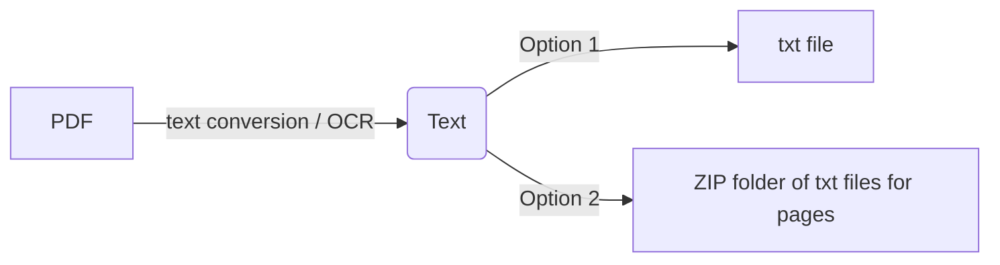

# PDF Text Extractor & AI Assistant 🚀
### By Ayush Salunkhe

[](https://streamlit.io)
[](https://www.python.org/downloads/)
[](https://opensource.org/licenses/MIT)

A powerful PDF text extraction tool with AI capabilities for summarization and intelligent Q&A. Extract, analyze, and interact with your PDF documents effortlessly.

## 🎯 Features

- **Text Extraction**: Extract text from PDFs with high accuracy
- **OCR Support**: Handle scanned documents with Tesseract OCR
- **Multi-language Support**: Process documents in English, French, Arabic, and Spanish
- **AI Summary**: Generate concise summaries using BART
- **Smart Chat**: Interactive Q&A with documents using Groq's Mixtral-8x7B
- **Export Options**: Download as single TXT or page-wise ZIP
- **Document Preview**: Built-in PDF viewer

## 🛠️ Technology Stack

- **Frontend**: Streamlit
- **AI/ML**: 
  - Groq (Chat)
  - BART (Summarization)
  - Tesseract (OCR)
- **Text Processing**: 
  - PDFMiner
  - pdf2image
  - LangChain
- **Vector Store**: FAISS
- **Embeddings**: HuggingFace (all-MiniLM-L6-v2)

## 🚀 Quick Start

### Prerequisites

### 1. Python Installation
1. Download Python 3.7+ from [Python.org](https://www.python.org/downloads/)
2. During installation, make sure to check "Add Python to PATH"
3. Verify installation by opening command prompt/terminal:
   ```
   python --version
   ```

### 2. Tesseract OCR Installation

#### Windows:
1. Download Tesseract installer from [UB-Mannheim](https://github.com/UB-Mannheim/tesseract/wiki)
2. Run the installer (Example: tesseract-ocr-w64-setup-5.3.1.20230401.exe)
3. During installation, note the installation path (default: `C:\Program Files\Tesseract-OCR`)
4. Add Tesseract to System PATH:
   - Open System Properties (Win + Pause/Break)
   - Click "Advanced system settings"
   - Click "Environment Variables"
   - Under System Variables, find and select "Path"
   - Click "Edit"
   - Click "New"
   - Add the Tesseract installation path (e.g., `C:\Program Files\Tesseract-OCR`)
   - Click "OK" on all windows

#### Linux:
```bash
sudo apt-get update
sudo apt-get install tesseract-ocr
sudo apt-get install poppler-utils
```

#### macOS:
```bash
brew install tesseract
brew install poppler
```

### 3. Poppler Installation

#### Windows:
1. Download Poppler from [poppler-windows](https://github.com/oschwartz10612/poppler-windows/releases/)
2. Extract the downloaded file
3. Add the bin folder to System PATH:
   - Follow the same steps as adding Tesseract to PATH
   - Add the path to poppler's bin folder (e.g., `C:\Program Files\poppler-23.11.0\Library\bin`)

#### Linux & macOS:
- Already installed with the commands above

## Project Setup

1. Clone the repository:
```bash
git clone <repository-url>
cd pdf-text-extractor
```

2. Create and activate virtual environment:
```bash
# Windows
python -m venv venv
venv\Scripts\activate

# Linux/macOS
python -m venv venv
source venv/bin/activate
```

3. Install required packages:
```bash
pip install -r requirements.txt
```

## How does it work?



### Usage Steps:
1. Run the application:
   ```bash
   streamlit run app.py
   ```
2. Open your browser and go to `http://localhost:8501`
3. Upload your PDF
4. Enable OCR (for scanned documents)
5. Select the PDF language
6. Download your output file (zip/txt)

## Troubleshooting

### Common Issues:

1. **Tesseract not found error:**
   - Verify Tesseract is in System PATH
   - Try restarting your computer after PATH modification
   - Check Tesseract installation by running in cmd/terminal:
     ```
     tesseract --version
     ```

2. **pdf2image/poppler error:**
   - Ensure poppler is correctly installed
   - Verify poppler bin directory is in System PATH
   - Restart your development environment

3. **ImportError: DLL load failed:**
   - Install Visual C++ Redistributable from [Microsoft](https://learn.microsoft.com/en-US/cpp/windows/latest-supported-vc-redist)

## Project Structure
```
pdf-text-extractor/
├── app.py              # Main Streamlit application
├── functions.py        # PDF processing utilities
├── requirements.txt    # Python dependencies
├── file_pages/        # Temporary storage for extracted pages
└── README.md          # Documentation
```

## Support the Project
You can help support the project through:
- Providing feedback and reporting issues
- Contributing to the code
- [Buy me a coffee](https://www.buymeacoffee.com/ayush05)

## License
This project is licensed under the MIT License.

